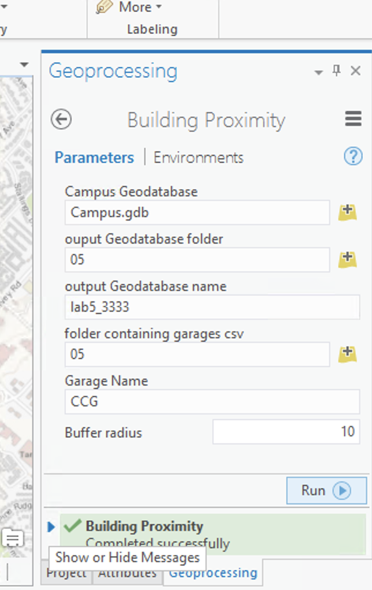
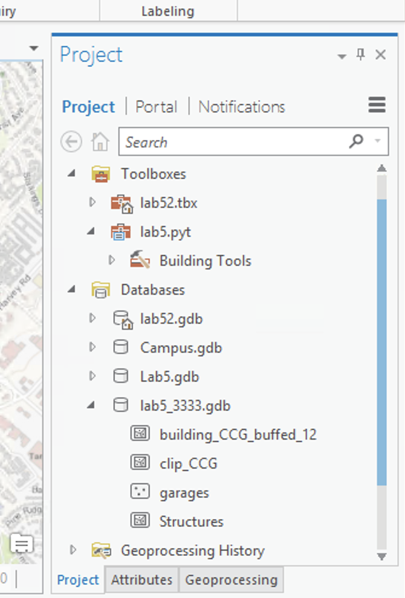

# arcGISBufferToolbox
this was a project for my GIS Programming class to create an easy buffer tool concerning a provided database and csv file. It outputs a geodatabase containting all the necessary layers as well as a clipped and buffered layer of the building selected from the garages csv file. 

